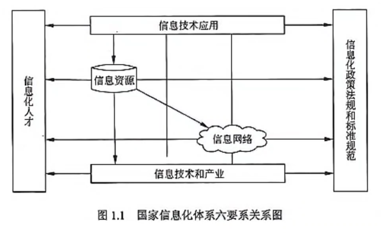
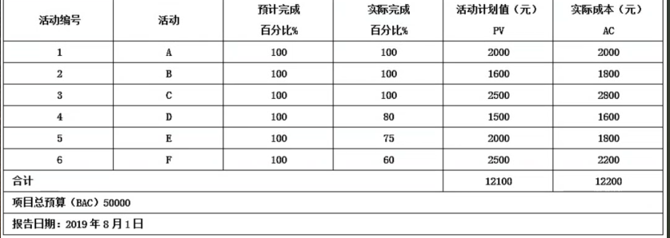
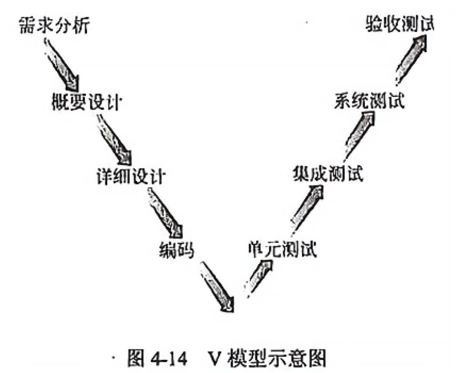

# 系统集成项目管理工程师

## 第一章 信息化基础知识

### 成本执行（绩效）指数（CPI）

实际成本（AC）

计划值（PV）

挣值 （EV）
$$
CPI = EV / AC
$$
例题：

 某信息化建设项目的状态数据为：实际成本(AC)=44150元，计划值(PV)=4…,挣值(EV)=36610元，则成本执行(绩效)指数是( )。
$$
CPI=EV/AC=36610/44150=0.83
$$

### 企业信息化发展的战略

（1）==以信息化带动工业化==；

（2）信息化与 企业业务全过程的融合、渗透；

（3）信息产业发展与企业信息化良性互动；

（4）信息产业发 展与企业信息化良性互动；

（5）高度重视信息安全；

（6）企业信息化与企业的改组改造和形 成现代企业制度有机结合；

（7）因地制宜推进企业信息化

### 信息化

我国信息化建设处于==深入发展阶段==

信息化的主体是==全体社会成员==

信息化从“小”到“大”分为：产品信息化、企业信息化、产业信息化、国民经济信息化和社会生活信息化。

企业信息化结构包括:
(1)产品(服务)层:

(2)作业层: 

(3)管理层: 

(3)决策层。

信息化的==目标== 是使国家的综合实力、社会的文明素质和==人民的生活质量全面达到现代化水平==

### 国家信息化体系要素

信息技术应用、

信息资源、

信息网络、

信息技术和产业、

信息化人才、

信息化法规政策和标准规范

### 数据库：大多数为关系结构

### 供应链管理

供应链系统设计的原则包括==自顶向下和自底向上相结合、简洁性原则、取长补短原则、动态性原则、合作性原则、创新性原则、战略性原则。==

供应链管理是以==客户为中心的==。整个供应链管理准求的目标，==首先是满足客户的需求==，衡量供应链管理绩效的最重要的指标就是客户满意度。
降低供应链的成本。提供供应链的响应速度等，都要以满足客户需求为前提。

### 物流管理

物流管理包括 ==销售管理、库存控制、釆购管理和人力资源管理==

### CRM (客户关系管理)

CRM所涵盖的要素主要有：

第一，CRM以信息技术为手段，但是CRM绝不仅仅是某种信息技术的应用，它更是一种以客户为中心的商业策略，CRM注重的是与客户的交流，企业的经营是以客户为中心，M不是传统的以产品或以市场为中心。

第二， CRM在注重提高==客户满意度的同时==，一定要把帮助==企业提高获取利润==的能力作为重要指标。

第三，CRM的实施要求企业对其业务功能进行重新设计，并对工作流程进行重组，将业务的中心转移到客户，同时要针对不同的客户群体有重点地采取不同的策略。

ERP系统相比CRM涵盖了更大范围内的管理对象，可以认为CRM系统是ERP系统的一部分

### 企业资源规划

大致经历了MRP、闭环MRP、MRPⅡ和ERP这四个阶段：

基本MRP (物料需求计划)根据主生产计划、物料清单、库存信息，制定出相关物资的需求时间表，从而即时==采购所需物资==，降低库存。 闭环MRP系统除了编制资源需求计划外，还要编制能力需求计划，并将生产能力需求计划、==车间作业计划和采购作业计划==与物料需求计划一起纳入MRP。

闭环MRP能力计划通常是通过报表的形式向计划人员报告，==尚不能进行能力负荷的自动平衡。==

 MRPII从整体最优的角度出发，通过运用科学方法对企业各种==制造资源和产、供、销、财各个环节进行有效组织、管理和控制==。

 ERP系统在MRPII的基础上扩展了管理范围，它把客户需求和企业内部的制造活动以及供应商的制造资源整合在一起，形成一个==完整的供应链并对供应链上的所有环节进行有效管理。==

### 加快电商支撑体系

加快电商支撑体系的5方面：“杏仁支物标” ==1.信用 2.认证 3.支付 4.现代物流 5.标准==

### 系统

CDS：内容分发服务；

CRM：客户关系管理；

IDS：入侵检测系统；

ERP：企业资源计划。    

### 客户数据

可以分为==描述性、促销性和交易性数据==三大类
描述性数据：客户是谁。
促销性数据：你曾经对这个客户作过什么。
交易性数据：客户对你曾做过什么。

### 企业应用集成

是在组织内外的各种异构系统，应用和数据源之间实现信息交流，共享或协作的途径，方法学，标准和技术

### 安全电子交易协议(SET)

安全电子交易协议(SET)是一种应用于因特网(Internet)环境下，==以信用卡为基础的安全电子交付协议==

### 数据的基本概念

==数据是信息的载体==，是描述客观事物的数、字符，以及所有能输入到计算机中，被计算机程序识别和处理的符号的集合。 信息是按照特定方式组织在一起的事实(数据或资料)的集合 ==信息的载体不仅仅只是数据。==

### 选择供应商

选择供应商最主要需要考虑的因素肯定应该是：==价格、时间、质量。==

### 信息的质量属性

==(1)完整性==，对事物状态描述的精准程度。
==(2)可验证性==，指信息的主要质量属性可以被证实或证伪的程度。
==(3)安全性==，指在信息的生命周期中，信息可以被非授权访问的可能性，可能性越低，安全性越高。
==(3)经济性==，指信息获取、传输带来的成本在可以接受的范围之内。

### 两网、一站、四库、十二金”工程

"两网"，是指政务内网和政务外网； 　　

"一站"，是政府门户网站；

"四库"，即建立人口、法人单位、空间地理和自然资源、宏观经济等4个基础数据库； 

“十二金”是面向政府办公业务建立的十二个重点信

## 第二章 信息系统服务管理

### IT 服务生命周期

规划设计--部署实施--服务运营-- 持续改进-- 监督管理

### IT 服务的核心要素

人员、过程、技术、资源

### 标准

目的是在特定的背景下达到最佳的秩序

### 信息系统审计

信息系统审计的==目的是评估并提供反馈==、保证及建议。其关注之处可被分为如下3类：
( )可用性：商业高度依赖的信息系统能否在任何需要的时刻提供服务？信息系统是否被完好保护以应对各种损失和灾难？
( )保密性：系统保存的信息是否仅对需要这些信息的人员开放，而不对其他任何人开放？
( )完整性：信息系统提供的信息是否始终保持正确、可信、及时？能否防止未授权的对系统数据和软件的修改？

### 完工估算(EAC)

$$
EV=PV*百分比
$$

$$
EAC=AC+(BAC-EV)
$$

PV=12100，AC=12200，EV=2000+1600+2500+1500*80%+2000*75%+2500*60%=10300
EAC=AC+ETC 非典型偏差，则有：EAC=AC+(BAC-EV)=12200+50000-10300=51900

### 计算机信息系统集成资质

计算机信息系统集成资质等级从高到低依次为一、二、三、四级”。

资质证书的==有效期为三年==。届满三年应及时更换新证，换证时需由评审机构对申请单位进行评审，评审结果达到原有等级条件时，其资质等级保持不变。

计算机信息系统集成的一、二级资质的审批中，==由省(自治区、直辖市)信息产业主管部门==对申请单位的申报材料进行审核，并审批。

一级资质：==注册资金2000万元以上==，通过国家认可的第三方认证机构认证并有效运行一年以上，具有经理人数不少于==25名==，其中高级项目经理人数不少于==8名==。

二级资质：==注册资金1000万元以上==，通过认证并有效运行一年以上，项目经理人数不少于==15名==，其中高级项目经理人数不少于==3名。==

三级资质：==注册资本200万元以上==，通过认证并能有效运行，具有项目经理人数不少于==6名==，其中高级项目经理人数不少于==1名。==

四级资质：==注册资本30万元以上==，计算机信息系统集成项目经理人数不少于==3名。==

## 第三章 信息系统集成专业技术知识

### IEEE 802系列标准

802.3   以太网

802.11 无线网 

802.15 蓝牙 

802.16 无线宽带 

### 协议

FTP   文件传输协议 上传下载  （进行两台计算机之间的文件传输）

HTTP   超文本传输协议 

SMTP   简单邮件传输协议 （是一组用于由源地址到目的地址传送邮件的规则，由它来控制信件的中转方式）

SNMP   简单网络管理协议 （用来对通信线路进行管理）

POP3   邮件服务器收发邮件 

Telent   远程服务 

SNMP   通信线路整理

Samba 用于服务器与客户端之间

### Web服务(Web Service)

适合的情况：

①跨越防火墙

②应用程序集成

③B2B集成

④软件重用

不适合的情况：

①单机应用程序

②局域网上的同构应用程序

### 数据仓库与数据库

数据仓库是一个面向主题的、集成的、相对稳定的、反映历史变化的数据集合，用于支持管理决策。

数据库是动态数据

### 项目工具

Bugzilla  是问题管理工具，
TestManager  是测试管理工具，
TrueCoverage   是白盒测试覆盖分析工具，
LoadRunner    是常用的性能测试工具。

### 生命周期模型

①需求明确 ，瀑布模型。

② 项目复杂 ，风险高 ，螺旋模型。

③ 项目实践 ，原型化模型。

④ 需求不明确， 多期 ，迭代模型。

### 经济可行性

经济可行性，主要从资源配置的角度衡量项目的价值，评级项目在实现区域经济发展目标、有效配置经济资源、增加供应、创造就业、改善环境、提高人民生活等方面的效益。

## 第四章 项目管理一般知识

### 项目生命周期

在项目的初始阶段，项目干系人影响项目的最终产品特征和项目最终费用的能力最高，随着项目的继续开展则逐渐变低。 

在项目策划阶段属于项目的早期，变更成本较低，一般来说变更带来的附加价值较高。在项目执行阶段，变更成本较高。

### 项目

项目是为达到特定的目的，使用一定的资源，在确定的时间内，为特定发起人提 供独特的产品、服务或成果而进行的一系列相关的活动的集合。

项目的三大特性：

1、临时性：明确的开始和结束时间。

2、独特性：也叫一次性。独一无二，独特性是项目的风险所在，也导致项目工作的挑战性和项目产品的竞争力。

3、逐渐细化性。任何一项工作，如果你更看重它的临时性、独特性和目标明确性(通过逐渐细化加以明确)，它就是“项目”。

### 执行过程组

执行过程组包括：

指导与管理项目工作、质量保证、组建项目团队建设项目团队、管理项目团队、管理沟通、实施采购、管理干系人参与

### 项目经理最常用的人际关系技能

包括领导力、影响力和有效决策。

### PMO（项目管理办公室）

PMO的一些关键特征
(1)在所有PMO管理的项目之间共享和协调资源。
(2)明确和制定项目管理方法、最佳实践和标准。
(3)负责制订项目方针、流程、模板和其他共享资料。
(3)为所有项目进行集中的配置管理。
(5)对所有项目的集中的共同风险和独特风险存储库加以管理。
(6)项目工具(如企业级项目管理软件)的实施和管理中心。
(7)项目之间的沟通管理协调中心。
(8)对项目经理进行指导的平台。
(9)通常对所有PMO管理的项目的时间基线和预算进行集中监控。
(10)在项目经理和任何内部或外部的质量人员或标准化组织之间协调整体项目的质量标准。

PMO为项目管理办公室，职能为支持，控制，指令，协调。

### 项目管理过程组

1、确定并描述了对于任何项目都必需的5个项目过程组。具有明确的依存关系并在各个项目中按一定的次序执行。它们与应用领域或特定产业无关。对于大多数行业的项目来讲，
2、项目过程组根据过程的性质启动、计划、执行(或称实施)、监控、收尾合并同类项，从而组成过程组。过程组不是项目的阶段
3、对大多数行业的项目来讲，==执行过程组会花掉多半的项目预算。==

###  整合者

整合者是项目经理承担的重要角色之一。==从宏观角度审视项目==

### 信息系统集成项目的技术过程和管理过程的正确顺序。

制定业务发展计划、项目需求分析、制定项目管理计划

口诀：==业务，需求分析，管理==

### V模型

V模型的左边下降的是开发过程各阶段，包括需求分析、概要设计、详细设计和编码。V模型的右边上升的是测试过程的各个阶段，包括单元测试、集成测试、系统测试和验收测试。

### 项目型组织

项目型组织的优点体现在如下方面：
(1) 结构单一，责权分明，利于统一指挥；
(2) 目标明确单一；
(3) 沟通简洁、方便；
(3) 决策快。
同时，项目型组织也存在着如下缺点：管理成本过高，如项目的工作量不足则资源配置效率低；项目环境比较封闭，不利于沟通、技术知识等共享；员工缺乏事业上的连续性和保障等。

### 信息系统的开发

信息系统的开发方法包括：结构化方法、原型法、面向对象方法三种

其中结构化方法的特点是

(1)遵循用户至上原则。

(2)严格区分工作阶段，每个阶段有明确的任务和取得的成果。

(3)强调系统开发过程的整体性和全局性。

(4)==系统开发过程工程化， 文档资料标准化。==

### 信息系统集成项目的特点

1. 具有多科学合作性质 

2. 具有独特性 

3. 集软件硬件及应用一体 

4. 不确定性 

5. 技术的敏感性 

6. 管理的复杂性

   信息系统集成项目区别于其它项目的特点是：==需求复杂多变，需求变更控制复杂==

### 项目目标

包括成==果性目标==和==约束性目标==。项目的==约束性目标也叫管理性目标==，项目的==成果性目标有时也简称为项目目标。==

项目目标的特点：==项目的目标有不同的优先级==，不同目标可能在项目管理不同阶段根据不同需要，其重要性不一样。

### 软件统一过程(RUP)

软件统一过程(RUP)是迭代模型的一种。

RUP的每个阶段，从上到陈代，亦即从核心过程工作流 “ 商业建模”“需求调研”“分析与设计” ……执行到 “部署”，再从核心支持工作流 “配置与变更管理”“项目管理”执行到 “环境” ，根据需要， 在一个阶段内部，可以完成==一次到多次的选代==

### 实施项目的组织结构

项目经理的权限从小到大：职能性组织—弱矩阵—平衡矩阵组织—强矩阵组织—项目性组织。

## 第五章 项目立项与招标管理

### 机会可行性研究

机会可行性研究的主要任务是对投资项目或投资方提出建议，并对各种设想的项目和有字机会做出鉴定，其目的是激发投资者的兴趣，寻找最佳的投资机会。 

### 详细可行性研究报告的内容包括

概述；需求确定；现有资源；设施情况分析；设计(初步)技术方法：项目实施进度计划建设：投资估算和资金筹措计划；项目组织、人力资源、技术培训计划；经济和社会效益分析(效果评价)：合作方式等。

### 项目可行性研究阶段包括

机会可行性研究；初步可行性研究；详细可行性研究；项目可行性研究报告的编写、提交和获得批准；项目评估。

### 项目的初步可行性研究关注的问题

 (1)项目进行投资建设的必要性。

 (2)项目建设的周期。

 (3)项目需要的人力、财力资源。

 (4)项目的功能和目标是否可以实现。

 (5)项目的经济效益、社会效益是否可以保证。 

 (6)项目从经济上、技术上是否是合理的。

### 项目招投标的描述

资格预审文件或者招标文件的==发售期不得少于 5 日；==

招标人再招标文件中要求投标人提交投标保证金的，投标保证金不得超过招标项目估算价的 ==2%；==

==一个招标项目只能有一个标底==

中标候选人==应当不超过 3 个并标明排序== 

### 成本补偿合同

主要适用于以下项目：需立即开展工作的项目、对项目内容及技术经济指标未确定的项目、风险大的项目。 

### 经济可行性

主要是从资源配置的角度衡量项目的价值，评价项目在实现区域经济发 展目标、有效配置经济资源、增加供应、创造就业、改善环境、提高人民生活等方面的效益。

### 系统集成商进行项目内部立项

系统集成商进行项目内部立项主要有几方面原因。
第一，通过项目立项方式为项目分配资源。
第二，通过项目立项方式确定合理的项目绩效目标，有助于 提升人员的积极性。
第三，以项目型工作方式，提升项目实施效率。

### 初步可行性研究可能出现4种结果

①肯定，对于比较小的项目甚至可以直接“上马”:

②肯定， 转入详细可行性研究，进入更深入详细的分析研究:

③展开专题研究，如建立原型系统，演示主要功能模块或者验证关键技术:

④否定，项目应该“下马”。

### 供应商项目立项

许多系统集成供应商采用==内部立项制度==对这种责任转移加以约束和规范。”

### 项目评估

项目评估是指在项目可行性研究的基础上，==由第三方==(国家、银行或有关机构)根据国家颁布的政策、法规、方法、参数和条例等，从项目(或企业)、国民经济、社会角度出发，对拟建项目建设的必要性、建设条件、生产条件、产品市场需求、工程技术、经济效益和社会效益等进行评价、分析和论证，进而判断其是否可行的一个评估过程

项目评估的方法有：
(1) 项目评估法和企业评估法；
(2) 总量评估法和增量评估法。

总量评估法的费用和效益测算采用总量数据和指标，确定原有固定资产重估值是估算总投资的难点。该法简单，易被人们接受，侧重经济效果的整体评估，但无法准确回答新增投入资金的经济效果。增量评估法采用增量数据和指标并满足可比性原则。这种方法实际上是把“改造”和“不改造”两个方案综合为一个综合方案进行比较，利用方案之间的差额数据来评价追加投资的经济效果。

==其难点是：确定原有固定资产重估值==

### 承建方的立项管理

承建方的立项管理主要包括项目识别、项目论证和投标等步骤。==项目识别是承建方项目立项的第一步==，其目的在于选择投资机会、鉴别投资方向。

==识别，论证，投标==

### 项目建议书的内容

项目的必要性、项目的市场预测、产品方案或服务的市场预测、项目建设必需的条件。

### 项目建议书应该包括的核心内容
①项目的必要性。
②项目的市场预测。
③产品方案或服务的市场预测。
④项目建设必需的条件。

### 项目建设的主要依据

项目建议书、可行性研究报告、初步设计方案和投资概算的批复文件是项目建设的主要依据

### 项目建议书总体建设方案中有:

1.建设原则和策略 

2.总体目标与分期目标 

3.总体建设任务与分期建设内容 

4.==总体设计方案==

### 项目取舍的依据(决策依据)

项目取舍的依据(决策依据)是==项目评估报告。==

### 项目识别的说法

可以从==政府导向==中寻找项目机会 

可以从==市场需求==中寻找项目机会 

可以从==技术发展==中寻找项目机会

### 投资误差

投资误差最多为==30%==

变更投资一旦超出已批复总投资额度==10%==就要重新报批可行性报告

### 项目论证的作用

(1) 确定项目是否实施的依据。
(2) 筹措资金、向银行贷款的依据。
(3) 编制计划、设计、采购、施工以及机构设置、资源配置的依据。
(3) 项目论证是防范风险、提高项目效率的重要保证。而数据资料是项目论证的支柱之一
项目论证的内容包括项目运行环境评价、项目技术评价、项目财务评价、项目国民经济评价、项目环境评价、项目社会影响评价、项目不确定性和风险评价、项目综合评价等。其中==财务评价是项目经济评价的主要内容之一，它是从项目的微观角度==，在国家现行财税制度和价格体系的条件下，从财务角度分析、计算项目的财务盈利能力和清偿能力以及外汇平衡等财务指标，据以判断项目或不同方案在财务上的可行性的技术经济活动。

### 项目论证的内容包括
(1)承建方技术可行性分析；
(2)承建方人力及其他资源配置能力可行性分析；
(3)项目财务可行性分析；
(3)项目风险分析；
(5)对可能的其他投标者的相关情况分析。

### 项目论证的作用主要体
①确定项目是否实施的依据
②筹措资金、向银行贷款的依据
③编制计划、设计、采购、施工及机构设置、资源配置的依据
④防范风险、提高项目效率的重要保证项目论证并不能避免风险的发生。

### 承建方项目论证

承建方项目论证包括：

(1)承建方==技术可行性分析==。
(2)承建方==人力及其他资源配置能力可行性分析。==
(3)项目==财务可行性分析。==
(3)==项目风险分析。==
(5)==对可能的其他投标者的相关情况分析。==

其中不包括需求验证。

### 风险因素及对策

市场风险 技术风险 财务风险 组织风险 法律风险 经济及社会风险

## 第六章 项目整体管理

### 项目整体管理

项目整体管理包括6个过程:制定项目章程、制定项目管理计划、指导和管理项目工作、监控项目工作、实施整体变更控制、结束项目或阶段。

### 项目文件

项目文件会影响项目管理工作，但==不属于项目管理计划==，除了极少数非文件类的成果（如确认的可交付成果、验收的可交付成果等）以及属于项目管理计划的内容以外，在项目管理过程中所产生的项目文件（如工作绩效报告、变更日志等）都是项目文件的组成部分。

### 纠正措施

纠正措施是为使==项目工作绩效重新与项目管理计划一致而进行的有目的的活动。== 

### 实施整体变更控制的概述

变更控制委员会是由主==要项目干系人==的代表所组成的—个小组，==项目经理可以是其中的成员之一==，但通常不是组长。该委员会负责审核变审请求，批准或否决这些变更请求。对于可能影响项目目标的变更，必须经过变更控制委员会的批准才能实施。

### 整体变更控制指出：

项目变更就是对被批准的项目管理计划的变更，而==被批准的项目管理计划==就是==项目基准==

### 整体变更控制的输入

(1)项目管理计划。
(2)申请的变更。
(3)工作绩效信息。
(4)可交付物。

### 项目行政收尾

1. 对项目产品的正式接受。
2. 完整的项目档案。
3. 组织过程资产更新(经验教训总结)。
4. 资源释放(包括人力和非人力资源)。

### 制定项目章程的输入包括:

(1) 项目工作说明书: 

(2)商业论证: 

(3)协议: 

(4)组织过程资产:

(5)事业环境因素。

### 指导与管理项目工作

==指导与管理项目工作==为实现项目目标而领导和执行项目管理计划中所确定的工作，并实施已批准变更的过程

### 指导与管理项目工作过程的输出包括

可交付成果、工作绩效数据、变更请求、项目管理计划更新、项目文件更新

### 项目章程应当包括

(1)基于项目干系人的需求和期望提出的要求。
(2)项目必须满足的业务要求或产品需求。
(3)项目的目的或项目立项的理由。
(3)委派的项目经理及项目经理的权限级别。
(5)概要的里程碑进度计划。
(6)项目干系人的影响。
(7)职能组织及其参与。
(8)组织的、环境的和外部的假设。
(9)组织的、环境的和外部的约束。
(10)论证项目的业务方案，包括投资回报率。
(11)概要预算。

### 项目章程的作用

- 确定项目经理，明确项目经理的权力;
- 正式确认项目的存在，给项目一个合法的地位;
- 规定项目总体目标，包括范围、时间、质量等;
- 通过叙述启动项目的理由，把项目与执行组织的日常经营运作及战略计划等联系起来。

==指导项目的执行、监控和收尾工作属于项目管理计划的作用。==

### 项目管理计划的主要用途有

- 指导项目执行、监控和收尾；
- 为项目绩效考核和项目控制提供基准；
- 记录制订项目计划所依据的假设条件；
- 记录制定项目计划过程中的有关方案选择；
- 促进项目干系人之间的沟通；
- 规定管理层审查项目的时间、内容和方式

### 项目管理方法论

在项目计划阶段，项目管理方法论帮助项目管理团队制定项目管理计划和控制项目管理计划的变更

==标准格式和模板==属于项目管理方法论的重要组成部分。

### 执行控制组

包括==质量保证==

### 监督和控制过程组

包括监督和控制项目工作、整体变更控制、范围核实、范围控制、进度控制、成本控制、质量控制、管理项目团队、绩效报告、管理项目干系人、风险监督与控制、合同管理等活动，

其中==不包括企业质量管理体系审计。==

### 监理活动的主要内容被概括为“四控、三管、一协调”。

其中的“四控”是指：

信息系统工程==质量控制====；==

信息系统工程==进度控制：==

信息系统工程==投资控制；==

信息系统工程==变更控制。==

### 工作说明书(SOW)

SOW的内容主要包括服务范围、方法、假定、工作量、变更管理等。

工作说明书与项目范围说明书的区别在于：工作说明书是对项目所要提供的产品、成果或服务的描述，项目范围说明书是通过明确项目应该完成的工作来确定项目范围。

==范围说明书明确范围， 工作说明书是对产品的成果服务的说明==

## 第七章 项目范围管理

### 需求管理计划

需求管理计划是范围管理计划的输出。依据是指作为输入

### 项目工作明确划定边界。 

什么是包括在项目之内的，什么是不包括在项目之外的，即为项目工作明确划定边界。 

### 工作分解结构

工作分解结构中各要素应该是相互独立的，要尽量减少相互之间交叉。 

### 合作

集合多方的观点和意见，得出一个多数人接受和承诺的冲突解决方案。

### 范围管理计划

范围管理计划是项目或项目集管理计划的组成部分，描述了如何定义、制定、监督、控制和确认项目范围。

范围管理计划是制定项目管理计划过程和其他范围管理过程的==主要依据==

### 范围说明书

详细的范围说明书或引用的文档通常包括以下内容：
1. 项目目标

2. 产品范围描述(项目范围描述)

3. 项目需求(验收标准)

4. 项目边界

5. 项目的可交付成果

6. 项目的制约因素

7. 假设条件

   

### 工作分解结构(WBS)

工作分解结构(WBS)详细地说明了==项目的范围==，详细描述了项目所要完成的工作。

WBS的组成元素有助于项目干系人检查项目的最终产品。

WBS的最低层元素是能够被评估的、可以安排进度的和被追踪的。

### 工作包

==WBS的最低水平的工作单元被称为工作包==，它是定义工作范围、定义项目组织、设定项目产品的质量和规格、估算和控制费用、估算时间周期和安排进度的基础。

==工作包的描述：可以在此层面上对其成本和进度进行可靠的估算==

### 确认范围

确认范围是正式验收已完成的项目可交付成果的过程。

确认范围需要审查可交付物和工作成果，以保证项目中所有工作都能准确地、满意地完成。

确认范围应该贯穿项目的始终，从WBS的确认或合同中具体分工界面的确认，到项目验收时范围的检验

### 确认范围过程中使用的工具与技术

1、==检查==

2、==群体决策技术==

### 范围确认

范围确认是客户等==项目干系人正式验收并接收已完成的项目可交付物的过程==
### 确认范围

确认范围的一般步骤如下：

==①确定需要进行确认范围的时间；==

②识别确认范围需要哪些投入；

③确定范围正式被接受的标准和要素；

④确定确认范围会议的组织步骤；

⑤组织确认范围会议

### 范围控制

范围控制是监控项目状态

### 范围确认的输入包括

==①项目管理计划；==

==②可交付物。==

### 范围确认的输出包括：

==①可接受的项目可交付物和工作；==

==②变更申请；==

==③更新的WBS和WBS字典。==

### 范围基准

==项目范围说明书==、==与之====联系的WBS以及WBS字典==作为项目的范围基准，

在整个项目的生命周期内，这个范围基准被监控、核实和确认。

### 编制范围管理计划

编制范围管理计划是范围管理的第一个过程，这个过程的主要工作就是规划如何开展范围管理工作。
(1)如何进行范围定义。
(2)如何开发WBS。
(3)如何进行范围确认。
(3)如何进行范围控制。

### 范围管理的五个过程是：

==编制范围管理计划、范围定义、创建工作分解结构、范围确认和范围控制。==

### 需求分析
(1) ==检测和解决==需求之间的冲突；
(2) 发现==软件的边界，以及软件及其环境如何交互：==
(3) 详细描述系统需求，以==导出软件需求。==
需求的实现属于软件设计与实现阶段的任务。

### 常用的需求分析方法有：

==面向数据流的结构分析==方法(SA)，

==面向对象的分析==方法(OOA)。

### 范围定义的输入包括以下内容：

①项目章程。
②范围管理计划。
③组织过程资产。
④需求文件。

### 项目是否完成

项目是否完成以==项目管理计划为标准==，

### 产品范围是否完成

而产品范围是否完成则以==产品要求作为衡量标准==。

### 工作分解结构的编制

需要==所有项目干系人==的参与

## 第八章 进度管理

### 绩效指数(TCPI)

TCPI=(BAC-EV)/(BAC-AC)

EV是挣值（实际干了多少）

实际成本（AC）
$$
TCPI={BAC-EV}/{BAC-AC}
$$
例题：

某项目中活动A的成本估算为1000元，总工期为10天，项目经理在施工第8天晚上查看工作进度，发现任务只完成70%，成本消耗了600元。为了不影响项目整按时完工，活动A需要按时完工，项目经理计划在现有成本条件下进行赶工，请计算活动A完工尚需绩效指数(TCPI)为( ).

​			TCPI = (BAC-EV) / (BAC-AC) =（1000-700) / (1000-600) = 300/400 = 0.75 

### 里程碑

里程碑是项目生命周期中的一个时刻，

里程碑的持续时间为零，

里程碑既不消耗资源也不花费成本，通常是指一个主要可交付成果的完成。

### 活动与工作包

活动与工作包是1 对 1或多对 1的关系，即有可能==多个活动完成一个工作包==

### 关键链法

==比较剩余缓冲时间与所需缓冲时间(==为保证按期交付)，有助于确定进度状态。

是否需要采取纠正措施，取决于所需缓冲与剩余缓冲之间的差值大小。

### 规划项目进度管理的输入：

项目管理计划、项目章程、组织过程资产、事业环境因素
