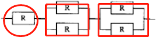
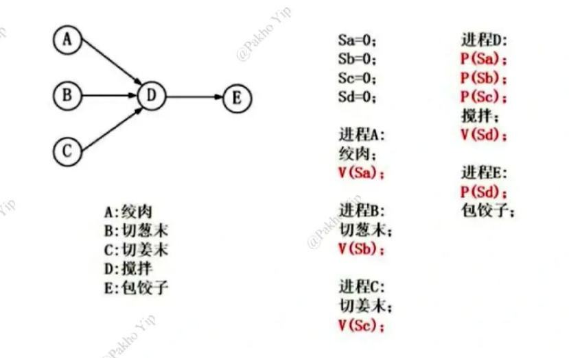
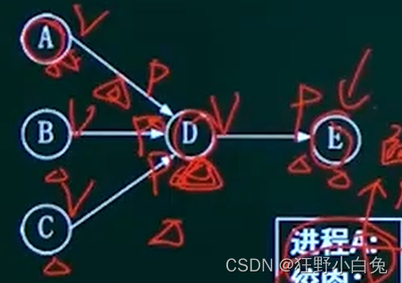
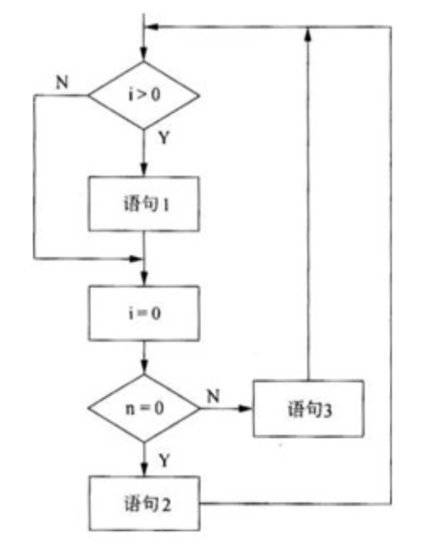
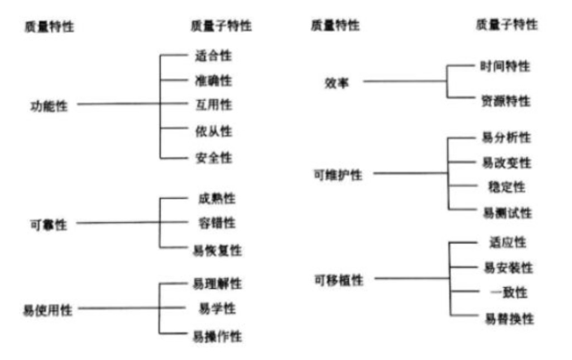
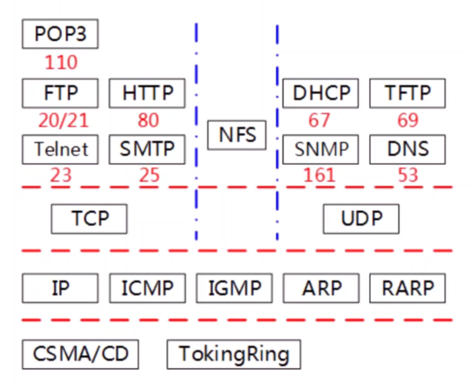
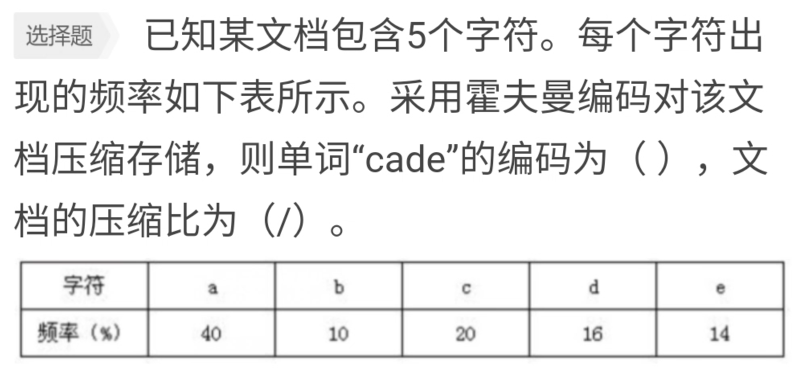
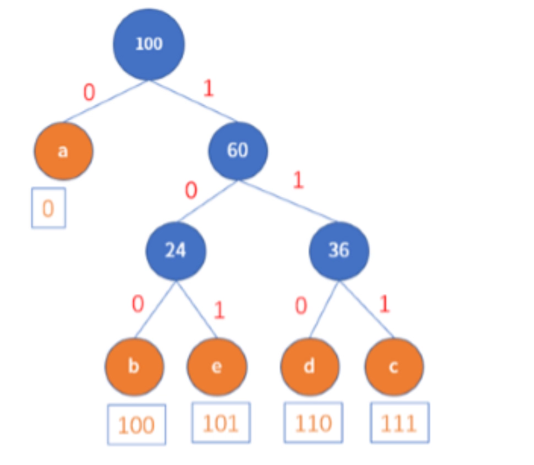
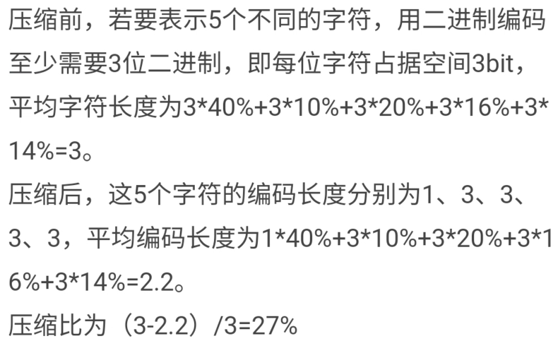

# 软件设计师

## 计算机组成与结构

### 系统可靠度计算公式

某计算机系统由下图所示的部件构成，假定每个部件的千小时可靠度R，则该系统的千小时可靠度约为 _ 。

  

解析：

上述题干中的部件可以看作三个部件串联，其中：

部件1的可靠度 = R 
部件2部件内并联的可靠度 

$$
1 − （ 1 − R ） × （ 1 − R ）
$$

部件3部件内并联的可靠度 

$$
1 − （ 1 − R ） × （ 1 − R ）
$$

所以最后结果 

$$
部件1可靠度 × 部件2可靠度 × 部件3可靠度 = R*（1-（1-R）^2）^2
$$

### 海明码校验位和数据位公式

设数据位是n位，校验位是k位，则n和k必须满足

$$
2^k-1>=n+k
$$

解析：

若n=48，则代入计算k=6才满足条件

$$
2^6>=k+49
$$

### 指令执行时间计算公式

#### 流水线方式

$$
一条指令所需时间+（指令条数-1）*时间最长的指令段
$$

解析：

通常可以将计算机系统中执行一条指令的过程分为取指令，分析和执行指令3步。

若取指令时间为4△t，分析时间2△t，执行时间3△t，若按照执行第i条，分析第i+1条，读取第i+2条重叠的流水线的方式执行，则从头到尾执行600条所需（）

$$
（4+2+3）+（600-1）*4 = 9△+599*4 = 2405△t
$$

#### 串行方式

$$
一条指令所需时间*指令条数
$$

$$
（4+2+3）*600=5400△t
$$

### 总线带宽计算

总线宽度（bit）转换单位（byte）

$$
总线宽度（bit）÷8=（Byte)
$$

计算总线带宽

$$
每一个时钟频率*总线宽度（Byte)=总线带宽（MB/s)
$$

解析：
总线宽度为32bit，时钟频率为200MHz，若总线上每5个时钟周期传送一个32bit的字，则该总线的带宽为() MB/s。

$$
32(bit)/8=4(Byte)
$$

$$
200(MHz)÷5*4（Byte)=160（MB/S）
$$

### 存储容量计算

解析：

内存按字节编址从B3000H到DABFFH的区域其存储容量为( ) 。

$$
DABFFH-B3000H+1=27C00H=162816=159k
$$

### 寻址范围计算

$$
内存容量（Byte）=内存容量（GB）*1024*1024*1024*8位
$$

$$
寻址范围（MB）=内存容量（Byte)/1024/1024/计算机字长
$$

解析：

若某计算机字长为32位，内存容量为2GB，按字编址，则可寻址范围为( ) 。

$$
内存容量=2*1024*1024*1024*8
$$

$$
2*1024*1024*1024*8÷1024÷1024÷32=512（MB）
$$

### 所需储存器芯片计算

芯片种类：

> 8bit芯片=1
>
> 4bit芯片=2

$$
所需芯片数量=存储容量/1000/芯片规格（k）*芯片种类
$$

解析：

若用256Kx8bit的存储器芯片,构成地址40000000H到40OFFFFFH且按字节编址的内存区域，则需(）片芯片。

$$
400FFFFF-40000000/1000/256*1=4
$$

## 程序语言

### 沟通路径计算

n 人数

$$
沟通途径条数=(n* (n-1) )/2
$$

### 算术表达式计算后缀表达式

1.从左到右依次读取算式的一个字符
2.如果读到括号，则跳过，到下一个字符
3.如果读到的是数字，则直接输出到一个结果字符串的末尾（这个字符串就是最后要的后缀表达式）
4.如果读到的是运算符，则要将此运算符入栈
（1）若栈空，则直接入栈；
（2）若栈不空，则要判断栈顶运算符的优先级
   <1>若栈顶运算符的优先级低于要入栈的运算符

​		  将栈顶运算符位置弹出

​		  然后入栈
   <2>若栈顶运算符的优先级高于要入栈的运算符

​          直接入栈

解析：

算术表达式x- (y+c）*8的后缀表达式：

1. 后缀表达式  x

   栈空间  

2. 后缀表达式 x

   栈空间 -

3. 后缀表达式 xy

   栈空间 - 

4. 后缀表达式 xy

   栈空间 -  +

5. 后缀表达式 xyc

   栈空间 - + 

6. 后缀表达式 xyc+

   栈空间 - * *（准备*  * 号入栈，优先级大于+号，所以+号出栈，* 号入栈，**保证栈空间优先级从上往下是从低到高**)

7. 后缀表达式 xyc+8*-

   栈空间（依次出栈）

## 操作系统

### 硬盘容量公式

#### 格式化容量

$$
格式化容量（B）=面数*（磁道数/面）*（扇区数/道）*（字节数/扇区）
$$

解析：

假设某硬盘由5个盘片构成(共有8个记录面),盘面有效记录区域的外直径为30cm,内直径为10cm，记录位密度为250位/mm，磁道密度为16道/mm，每磁道分16个扇区，每扇区512字节，则该硬盘的格式化容量约为（)

题目中给出硬盘的面数为8，每面的磁道数为(30-10) ×10÷2x16，每磁道扇区数为16，每扇区512字节，因此其格式化容量为

$$
\frac{8*(30-10)*10*16*16*512}{2} (B)
$$

#### 非格式化容量

$$
格式化容量（B）=面数*（磁道数/面）*内圆周长*最大位密度
$$

### 段页式存储管理系统

12位（页内地址）= 212或4K（页大小）

12位（页号） =  212或4096（页数）

8位（段号） = 28或256（段数）

### 死锁公式

n个进程互斥[并发](https://so.csdn.net/so/search?q=并发&spm=1001.2101.3001.7020)执行，每个进程需要r个资源，计算可以避免死锁现象的最少资源m

$$
m = n * (r - 1) + 1
$$

### 单双缓冲区时间计算

#### 单缓冲区

$$
（每个盘读入缓冲区时间+缓冲区送至用户区时间）*磁盘块个数+每个磁盘块处理时间
$$

#### 双缓冲区

$$
每个盘读入缓冲区时间*磁盘块个数+缓冲区送至用户区时间+每个磁盘块处理时间
$$

### 索引最大长度

磁盘块大小1KB，每个块号占3B，因此一个磁盘物理块可存放1024/3=341个块号

#### 一级索引

$$
341*磁盘块大小(B)/1024=341KB
$$

#### 二级索引

$$
341*341*磁盘块大小(B)/1024=116281KB
$$

### 前趋图

箭头流出的地方是前趋【V(S)】，箭头流入的地方是后继【P(S)】，根据上下文推算

  

### 编译程序分析源程序的阶段依次

（输出：源程序字符串）词法 （输出：记号流）-> （输入：记号流）语法（输出：语法树） -> 语义

## 软件工程基础知识

### 软件过程管理

（1）初始级：软件过程的特点是无秩序或说无定规的，有时甚至是混乱的。软件过程定义几乎处于无章法、无步骤可循的状态。

（2）可重复级：已建立了基本的项目管理过程，可用于对成本、进度和功能特性进行跟踪。

（3）已定义级：用于管理的和工程的软件过程均已文档化、标准化，并形成了整个软件组织的标准软件过程。

（4）已管理级：软件过程和产品质量有详细的度量标准。软件过程和产品质量得到了定量的认识和控制。 

（5）优化级：通过对来自过程、新概念和新技术等方面的各种有用信息的定量分析，能够不断地、持续地对促进过程进行改进。

### 设计模式

**一、创建型设计模式**
1、Abstract Factory（抽象工厂）
2、Builder（生成器）
3、Factory Method（工厂方法）
4、Prototype（原型）
5、Singleton（单例）
**二、结构型设计模式**
1、Adapter（适配器模式）
2、Bridge（桥接模式）
3、Composite（组合模式）
4、Decorator（装饰模式）
5、Facade（外观模式）
6、Flyweight（享元模式）
7、Proxy（代理模式）
**三、行为型设计模式**
1、Chain of Responsibility（责任链模式）
2、Command（命令模式）
3、Interpreter（解释器模式）
4、Iterator（迭代器模式）
5、Mediator（中介者模式）
6、Memento（备忘录模式）
7、Observe（观察者模式）
8、State（状态模式）
9、Strategy（策略模式）
10、Template Method（模板方法）
11、Visitor（访问者模式）

### 项目里程碑

1、关键路径，就是最长时间的一条路
2、点最早开始时间，就是到达改点最长时间的一条路
3、点的最晚开始时间，就是关键路径-该点到终点的最大值
4、活动最多可以耽搁的时间，就是后继点的最晚开始时间-前继点的最早-该活动时间
5、活动的最晚开始时间，就是关键路径-起点到终点的最小值
6、松弛时间 = 关键路径 - 包含该活动的关键路径

### McCabe度量法

 流图G的环形复杂度

$$
V(G)=E-N+2
$$
其中，E是流图中流程线，N是节点数 

解析：采用McCabe度量法计算下图的环路复杂度为

图中节点数为6，流程线为8，环路复杂度为8-6+2

### 软件质量模型及子特性

## 数据库原理

### 函数依赖集和候选关键字

候选关键字：只出现在函数依赖集左部

## 网络和多媒体基础知识

### 图像和光盘数量计算

$$
\frac{图像数量*分辨率*操作系统位}{8*每张光盘容量（B）}
$$

10000张分辨率为1024*768的真彩（32位）图片刻录到DVD光盘，每张光盘可以存放4GB，则需要多少张光盘。

$$
\frac{10000*1024*768*32}{8*4*2^{30}}
$$

### 图像数据量计算

$$
\frac{(DPI*照片长)*（DPI*照片宽）*图像位数}{8}
$$

使用150DPI扫描分辨率扫描一幅3*4英寸的彩色照片，得到原始的24位真彩色图像的数据量是(Byte)

$$
\frac{(150*3)*（150*4）*24}{8}
$$

### 网络体系结构及端口

### 异步通信有效数据数率

$$
有效数据数率=数据位*每秒钟传送字符数
$$

## 数据结构及算法

### 霍夫曼编码及文档压缩比

#### 构造哈夫曼树

1.所有次数总和构造根节点

2.只在非关键字节点中生成子节点

3.大的数在右边

#### 文档压缩比

### 各算法排序时间复杂度（基本有序）

#### 插入

最好情况：

$$
O(n)
$$
其他情况：

$$
O(n^2)
$$

#### 快排

最好情况：

$$
O(nlgn)
$$
其他情况：

$$
O(n^2)
$$

#### 归并和堆排

$$
均为O(nlgn)
$$

