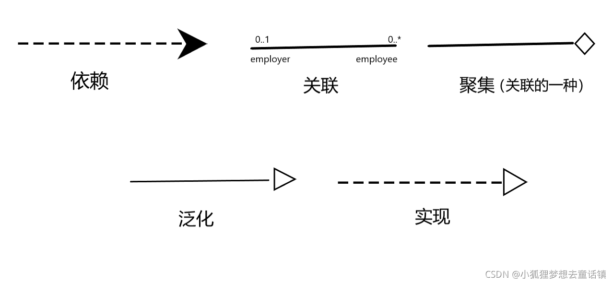
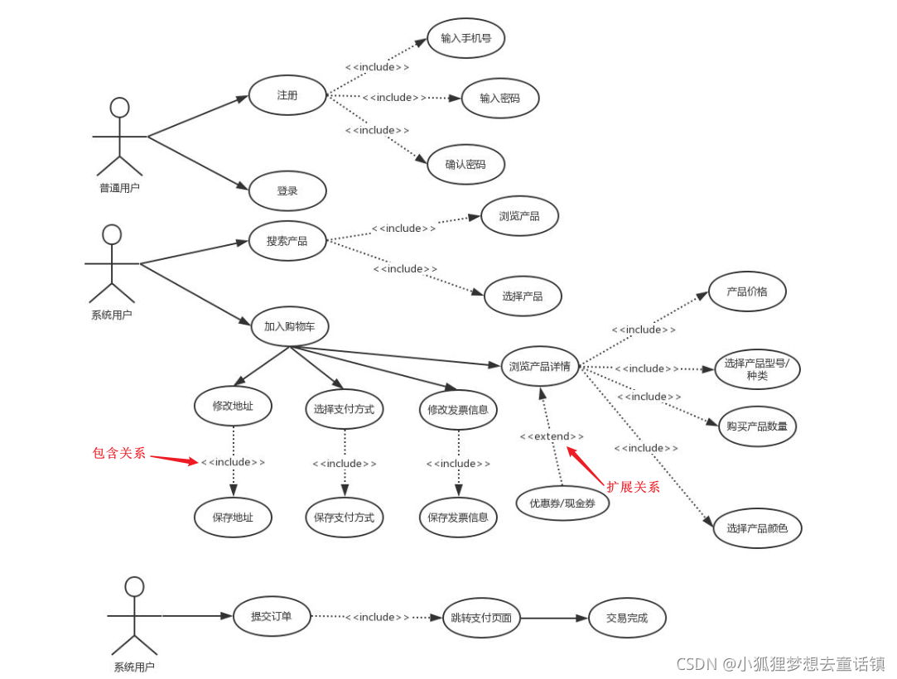
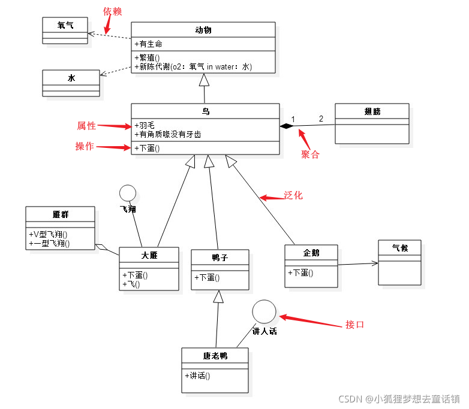
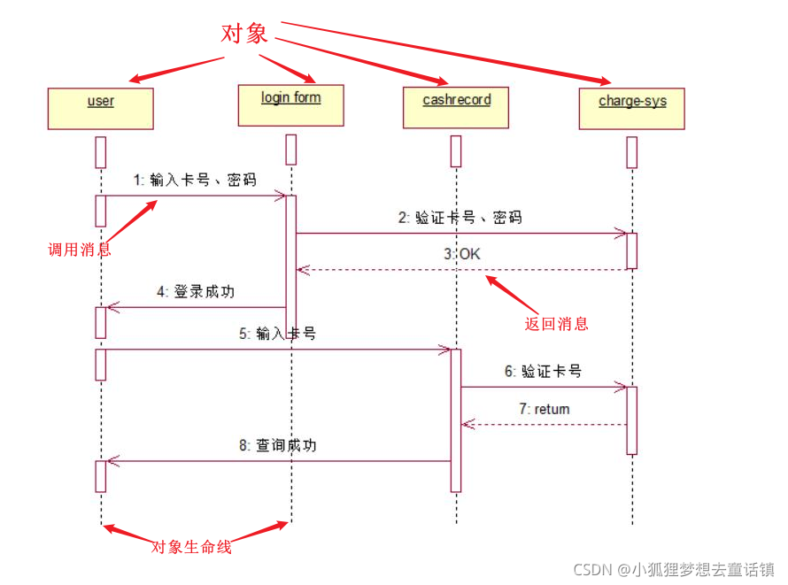
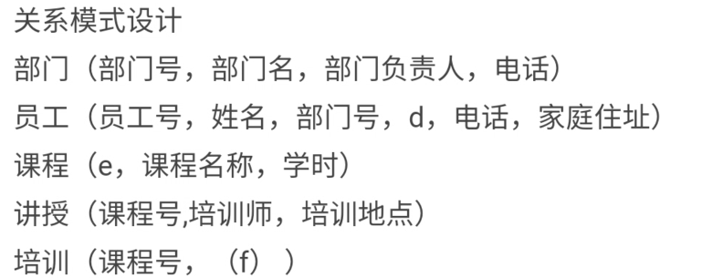
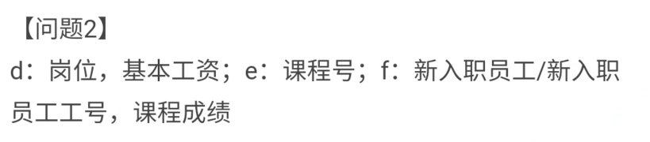
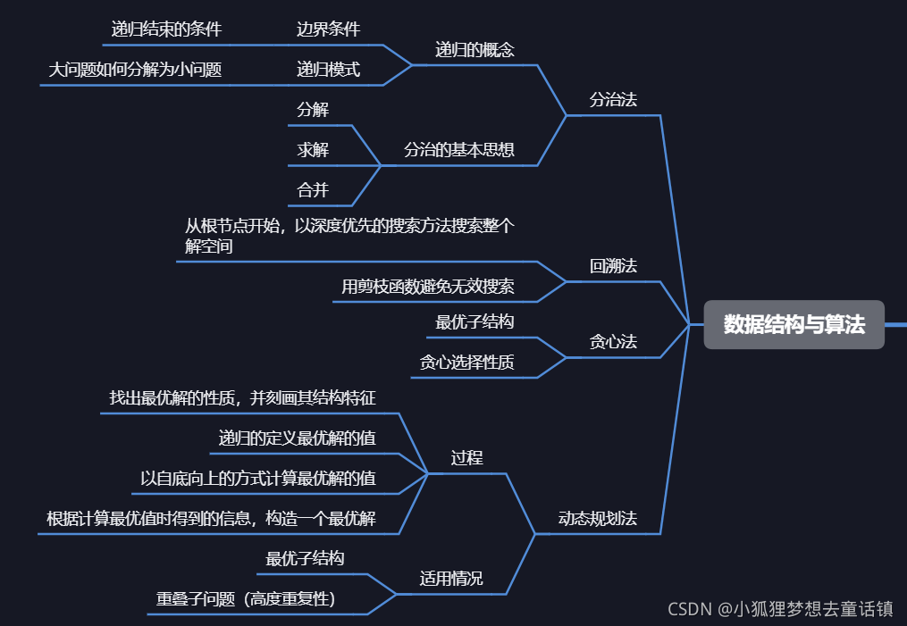

# 软件设计师（下午）

## 数据流图

### 实体名称根据子流图（0层数据流图）产生


### 数据存储如果找不到名称需要自己取名

注意带有“文件”、“表”、“库”、“清单”、“档案”等词汇；

XX数据流进来就是XX信息表

如监控信息   直接叫监控信息表


### 缺失的数据流及其起点和重点

第一步：根据父图（上下文数据流图）对照子图（0层数据流图）是否平衡

第二步：每个加工既要有输入数据流，也要有输出数据流

第三步：查看加工是否对应题功能文字描述

数据流起点/终点必有一个是加工

从**数据存储中获取**是D -> P

**修改或新建数据存储**是 P -> D

### 数据流图分解子加工三点注意

有输入但是没输出（黑洞）

有输出但是没出入（白洞）

输入不足以产生输出——感觉输入输出不对版（灰洞）


### 结构化语言

#### 选择语句

```stylus
IF 条件 THEN
    分支内容
ELSE IF 条件 THEN
    分支内容
ELSE
    分支内容
ENDIF
```


#### 循环语句

```stylus
WHILE 下雨 
DO
{
    在家
    IF 不下雨 THEN
        出门
    ENDIF
}
ENDDO
```


## UML图



### 用例图



#### 用例和用例之间三种关系

包含（行为全包括），使用虚线箭头<<include>>字样，箭头指向**被包含**的用例

扩展（可选情况才发生）虚线箭头<<extend>>字样，箭头指向**被扩展**的用例

泛化（行为多选一），带空心三角箭头的实线，箭头指向父类


### 类图




### 序列图



## 实体联系图

### 关系模式的键可填多个






### 实体不等于关系模式

实体是名词：员工，部门，业务员等

关系模式（联系）是动词：任职，培训 等


### 关系模式完整性约束表示

名称下面实线是主键

名称下面虚线是外键


### 实体联系图的属性在图中表示

使用圆圈起来 用直线连接到联系上


### 候选码、全码、主属性和非主属性

候选码：主键或外键

全码：属性中全都是候选码

主属性：所有候选码中并集的任意一个属性

非主属性：不包含在候选码中的属性


## 算法



### 用了什么设计策略

分治/动态规划/贪心/回溯这么几种，实在不会判断的话就从分治/动态规划中蒙一个

1、贪心法，在每一步上都找最优的解，头也不回。
2、动态规划法，带着备忘本的好少年，返回值是数组（历史子问题的最优解，有最优子结构）
3、回溯法，返回上一步（类似图的深度遍历），一旦发现这个选择不是最优或者达不到目标就往回退

4、分治法，把大问题分成几个小问题的组合

### 求复杂度问题


#### 时间复杂度

我们经常用到 o (1), o (n), o (logn), o (nlogn) 来表示对应算法的时间复杂度。

时间复杂度的排序是O(1) < O(logn) < O(n) < O(nlogn) < O(n^2) < O(2^n) < O(n!) < O(n^n)。

（1）时间复杂度为 O (1)，代码只被执行一次。

（2）时间复杂度为 O (2^n)， 一个for循环的时间复杂度。

（3）O(n^2)就是嵌套for循环，就是两个for循环，是不是相当于运行了n*n次。比如冒泡和选择排序。

（4）再比如 O (logn)，（ log 是以 2 为底）。二分搜索就是 O (logn) 的算法，每找一次排除一半的可能。

（5）O (nlogn) 同理，就是 n 乘以 logn，归并排序就是 典型的例子。 

#### 空间复杂度
看有没有开辟数组，没有就是O1，一维数组On，二维数组On2，

可以类比于时间复杂度

（1）O(1)单个变量所占的空间永远为1

（2）O(n)数组里面有n个值，占用了n个内存单元

（3）O(n^2)可以想象为一个正方形，边长为n，存储了n的二次方个变量


## java

关键字

interface

implements

abstract

extends


## 简答题模板答案

### 数据流图

#### 在绘制数据流图的加工时，可能出现的输入、输出错误

1、只有输入而无输出或者黑洞
2、只有输出而无输入或者奇迹
3、输入的数据流无法通过加工产生输出流或者灰洞
4、输入的数据流与输出的数据流名称相同

#### 说明实体之间可否有数据流，并解释其原因

实体之间不可以有数据流，因为数据流的起点和终点中必须有一个是加工

#### 如果采用“第三方Email系统”，那么需要进行哪些修改？用150字以内文字加以说明

图1-1中：增加外部实体“第三方Email系统”，将所有发送给客户的消息数据流，终点均修改至“第三方Email系统”。
图1-2中：增加外部实体“第三方Email系统”，增加加工“发送邮件”，将临时预订/预订/变更确认信息终点均修改至“发送邮件”加工，并增加从D2到“发送邮件”加工的数据流“电子邮件地址”，再从发送邮件加工引出数据流（临时预订/预订/变更确认信息)终点为第三方Email系统

#### 简要说明面向数据结构设计方法的基本思想及其适用场合

面向数据结构的设计方法（如Jackson方法）就是用数据结构作为程序设计的基础，最终目标是得出对程序处理过程的描述，适合在详细设计时使用。即在完成了软件结构设计之后，可以使用面向数据结构的方法来设计每个模块的处理过程，常用于规模不大的数据处理系统。使用面向数据结构的设计方法，当然首先需要分析确定数据结构，并且用适当的工具清晰地描述数据结构。

#### 简要说明程序流程图的适用场合与作用

程序流程图通常在进行详细设计时使用，用来描述程序的逻辑结构

#### 说明建模图 1-1 和图 1-2 时如何保持数据流图平衡

父图中某个加工的输入输出数据流必须与其子图的输入输出数据流在数量上和名字上相同。

父图的一个输入（或输出）数据流对应于子图中几个输入（或输出）数据流，而子图中组成的这些数据流的数据项全体正好是父图中的这一个数据流
